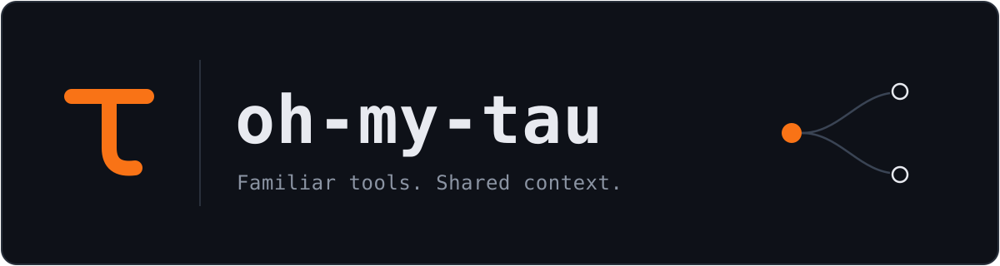

# oh-my-tau



oh-my-tau builds on [Oh My Pi](https://github.com/can1357/oh-my-pi) with model profiles, context-sharing subagents, and a Fusion mode inspired by Devin Fusion. It keeps OMP's tools and integrations while changing how supported models receive instructions and delegate work.

## What is different, and why?

Frontier coding models such as Claude and GPT are often post-trained, including through reinforcement learning, to work in their providers' coding environments. That training can favor particular system prompts, tool interfaces, and interaction patterns. A model may perform best in the environment it was tuned for.

The idea behind this fork is to make supported models feel at home in OMP. Its Claude Code and Codex profiles load the native client prompts locally and present familiar tool names and schemas, adapted to OMP execution. This reduces avoidable differences from those environments while keeping OMP's tools and integrations, including tools with no native counterpart.

The goal is to minimize mismatch risk. Conversation forks and Fusion mode extend how agents share context and divide work. These adaptations do not guarantee identical behavior or cost savings; provider subscriptions and usage limits still apply.

## Setup

You need Bun, Rust/Cargo, Git, and Python 3. Install and sign in to Claude Code or Codex for the corresponding profile. Sign in to Devin CLI if you want to use the default SWE-2 sidekick.

1. Install the fork:

   ```sh
   git clone https://github.com/AshishKumar4/oh-my-tau.git
   cd oh-my-tau
   ./scripts/install-harness.sh
   ```

2. Start OMP in your project:

   ```sh
   cd /path/to/your/project
   omp
   ```

3. Inside OMP, use `/login` if needed to connect a provider, then `/model` to choose a supported model. Or select one when starting OMP:

   ```sh
   omp --model openai-codex/gpt-6-astra
   omp --model anthropic/claude-opus-5
   ```

The installer sets up profiles for the clients it finds on your PATH. Claude Code and Codex system prompts load from your local profile cache; they are not bundled in this repository.

## Profiles and forks

Profiles adapt familiar tool names and schemas to OMP execution. OMP tools without a matching counterpart remain available. Profiles do not promise identical behavior or request settings to the original clients.

Codex `spawn_agent` inherits the resolved parent conversation by default. Use `fork_turns: "none"` for a fresh context, or a positive integer string for recent turns. Each child keeps its own session and tool state.

Full same-model forks can reuse cached context when the account and tool contracts are compatible. Restricted tools, forced tool choices, or changed history use normal replay. Other models receive the conversation through their normal provider conversion.

## Fusion mode

Fusion mode is inspired by Devin Fusion. A lead agent plans and reviews the work; a persistent sidekick implements and verifies it.

Inside OMP:

```text
/fusion on
/fusion status
/fusion devin/swe-2:high
/fusion off
```

Each lead has one sidekick. Calling it again updates the current handoff. For parallel work, use separate agent lanes. An agent definition with `sidekick: true` can lead its own sidekick.

## Updates and configuration

Run `./scripts/install-harness.sh` again to update the installation. After updating Claude Code or Codex, use `--record-only` to refresh local profile data. Use `--build-only` to skip profile setup.

Set `OMP_HARNESS_CACHE_DIR` to choose a different local profile cache. The default is `~/.omp/cache/harness`. Configure Fusion through `/fusion` or the settings panel.

Fusion instructions are adapted from MIT-licensed OpenCode Fusion and OpenHands sources; they are tuned for SWE-2, so changing the worker model does not select another instruction variant.

For OMP's other features and settings, see the [upstream documentation](https://github.com/can1357/oh-my-pi#readme).

## Credits and license

Built on [Oh My Pi](https://github.com/can1357/oh-my-pi) by [@can1357](https://github.com/can1357), which builds on [Pi](https://github.com/badlogic/pi-mono) by [@mariozechner](https://github.com/mariozechner).

See [LICENSE](LICENSE) and [THIRD-PARTY-NOTICES.txt](THIRD-PARTY-NOTICES.txt).
